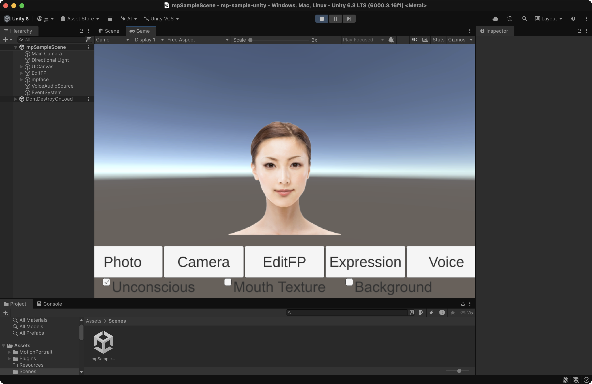

# MP Animator Unity Sample tutorial

## Requirements

- Unity 6.3 LTS (6000.3.16f1) and later

## Supported platforms

- Deployment to Windows, Mac, iOS, Android and Linux

## Setup

Clone this repository and open the project in unity.

```
git clone https://github.com/ailia-ai/mp-sample-unity.git
```

This repository automatically download MP Animator SDK from Unity Package manager.

## Run

You can run it by opening the sample scene (Assets/Scenes/mpSampleScene.unity) and pressing the Play button.



You can also build, install and run a standalone application for each platform.

## Operation Manual

For details on how to operate the sample program, please refer to the operation manuals at the links below.

[English Version](http://ailia.ai/mp/docs/mp_animator_unity_manual_en.pdf)

[Japanese Version](http://ailia.ai/mp/docs/mp_animator_unity_manual_ja.pdf)

